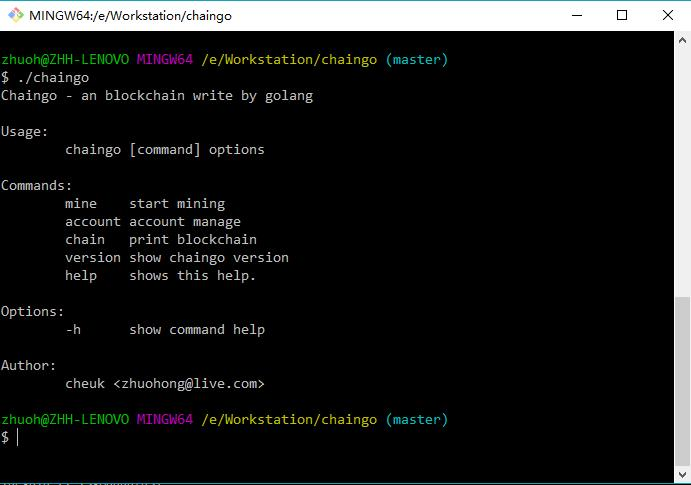
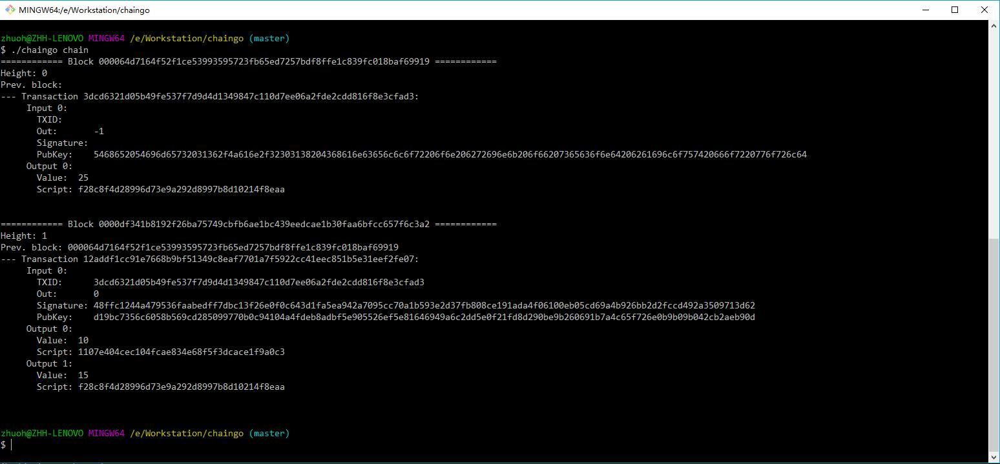

# Chaingo

这是使用go语言开发的区块链。A simple Blockchain in Golang

# Screenshots

# 说明

[1] 区块链存储采用leveldb

[2] 挖矿难度目前固定较低，出块不会太长

[3] 节点的发现目前只是硬写入了测试的一些端口，只是简单的服务

[4] 自带区块文件，钱包，通过chain_test.go可以创建创世块

[5] 挖矿奖励固定，可以无限挖（未实现减半）

[6] 可以自行编译，查看命令帮助

# 参考
[https://github.com/Jeiwan/blockchain_go](https://github.com/Jeiwan/blockchain_go)

[https://github.com/liuchengxu/blockchain-tutorial/blob/master/SUMMARY.md](https://github.com/liuchengxu/blockchain-tutorial/blob/master/SUMMARY.md)